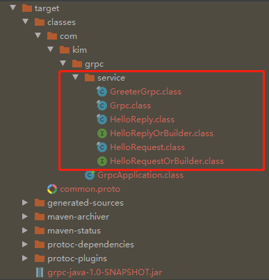

# Grpc简介:
gRPC和restful API都提供了一套通信机制，用于server/client模型通信，而且它们都使用http作为底层的传输协议(严格地说, gRPC使用的http2.0，而restful api则不一定)。
不过gRPC还是有些特有的优势，如下：
- gRPC可以通过protobuf来定义接口，从而可以有更加严格的接口约束条件。关于protobuf可以参见笔者之前的小文Google Protobuf简明教程
另外，通过protobuf可以将数据序列化为二进制编码，这会大幅减少需要传输的数据量，从而大幅提高性能。
- gRPC可以方便地支持流式通信(理论上通过http2.0就可以使用streaming模式, 
但是通常web服务的restful api似乎很少这么用，通常的流式数据应用如视频流，一般都会使用专门的协议如HLS，RTMP等，这些就不是我们通常web服务了，而是有专门的服务器应用。）

# 调用模式:
1. 普通模式common，客户端请求 -> 服务端即时响应返回。
2. 客户端流式请求模式customstream,客户端连续发送多次请求 -> 服务端响应返回一次数据。
3. 服务端流式请求模式serverstream,客户端发送一次请求 -> 服务端响应返回多次数据。
4. 双向流式请求模式bidirectionalstream,客户端发送多次请求 -> 服务端响应返回多次数据。

# 使用
## 1、pom.xml文件添加依赖和插件
```xml
        <dependencies>
    <!--grpc-->
            <dependency>
                <groupId>io.grpc</groupId>
                <artifactId>grpc-netty-shaded</artifactId>
                <version>1.25.0</version>
            </dependency>
            <dependency>
                <groupId>io.grpc</groupId>
                <artifactId>grpc-protobuf</artifactId>
                <version>1.25.0</version>
            </dependency>
            <dependency>
                <groupId>io.grpc</groupId>
                <artifactId>grpc-stub</artifactId>
                <version>1.25.0</version>
            </dependency>
        </dependencies>
    <build>
        <!--grpc插件-->
        <extensions>
            <extension>
                <groupId>kr.motd.maven</groupId>
                <artifactId>os-maven-plugin</artifactId>
                <version>1.6.2</version>
            </extension>
        </extensions>
        <plugins>
            <!--grpc、protobuf插件-->
            <plugin>
                <groupId>org.xolstice.maven.plugins</groupId>
                <artifactId>protobuf-maven-plugin</artifactId>
                <version>0.6.1</version>
                <configuration>
                    <protocArtifact>com.google.protobuf:protoc:3.10.0:exe:${os.detected.classifier}</protocArtifact>
                    <pluginId>grpc-java</pluginId>
                    <pluginArtifact>io.grpc:protoc-gen-grpc-java:1.25.0:exe:${os.detected.classifier}</pluginArtifact>
                </configuration>
                <executions>
                    <execution>
                        <goals>
                            <goal>compile</goal>
                            <goal>compile-custom</goal>
                        </goals>
                    </execution>
                </executions>
            </plugin>
        </plugins>
    </build>
```
## 2、定义protobuf文件,注意protibuf文件必须放在项目根目录src/main下面
以下为普通模式，其他模式参考代码
```proto
syntax = "proto3";   //指定proto版本为proto3
//普通模式:请求-响应
option java_multiple_files = true;  //是否为多文件
option java_package = "com.kim.grpc.service";  //指定生成的java类的包名
option java_outer_classname = "Grpc";           //java输出grpc的类名
option objc_class_prefix = "Common";            //随意指定

package service;   //包名与上面保持一致

// 定义一个服务类
service Greeter {
  // 定义一个方法作为服务端和客户端的交互
  rpc SayHello (HelloRequest) returns (HelloReply) {}
}
//protobuf参数数据类型和格式自行研究
//  请求类，设置请求参数
//参数中的=1，=2，=3是指参数定义顺序，由上至下
message HelloRequest {
  string name = 1;
  bytes input=2;//文件流传输格式
  bool flag=3;  //布尔值传入类型
}

// 返回类，设置返回参数
//参数中的=1，=2，=3是指参数定义顺序，由上至下
message HelloReply {
  string message = 1;
}
```
## 3、构建grpc生成类
先进行maven clean，再进行maven install,然后会在target目录下生成grpc的类


## 4、创建客户端类，假设客户端在java端下
```java
public class CommonClient {


    private ManagedChannel channel;

    private GreeterGrpc.GreeterBlockingStub blockingStub;

    //初始化连接，传入ip和端口号
    public void init(String host,int port){
        ManagedChannel channel= ManagedChannelBuilder.forAddress(host,port)
                .usePlaintext()
                .build();
        this.channel=channel;
        this.blockingStub=GreeterGrpc.newBlockingStub(channel);
    }

    //停止
    public void shutdown() throws InterruptedException {
        if(channel!=null){
            System.out.println(channel.authority());
            channel.shutdown().awaitTermination(5, TimeUnit.SECONDS);
        }
    }


    //连接服务端
    public String greet(String msg,boolean flag,InputStream in) throws IOException {
        System.out.println("客户端请求:"+msg);
       
        //设置请求参数，与protobuf文件定义的一致,InputStream流转化为bytes数据类型使用ByteString.readFrom(in)
        HelloRequest request= HelloRequest.newBuilder().setName(msg).setFlag(flag).setInput(ByteString.readFrom(in)).build();
        HelloReply response=null;
        try{
            //接收服务端响应的数据
            response=blockingStub.sayHello(request);
        }catch(Throwable e){
            e.printStackTrace();
        }
        String responseMsg=response.getMessage();
        System.out.println(responseMsg);
        return responseMsg;
    }

}
```
## 5、创建服务端类，假设服务端在Java端的情况下
```java
public class CommonServer {

    private Server server;

    public void start() throws IOException {
        //监听端口号
        int port=50050;
        server= ServerBuilder.forPort(port)
                .addService((BindableService) new GreeterImpl())
                .build()
                .start();
        Runtime.getRuntime().addShutdownHook(new Thread(){
            @Override
            public void run() {
                shutdown();
            }
        });

    }

    //停止
    public void shutdown(){
        if(server!=null){
            server.shutdown();
        }
    }

    //直到停止时断开
    public void blockUntilShutdown() throws InterruptedException {
        if(server!=null){
            server.awaitTermination();
        }
    }


    static class GreeterImpl extends GreeterGrpc.GreeterImplBase {
        @Override
        public void sayHello(HelloRequest request, StreamObserver<HelloReply> responseObserver) throws InterruptedException, IOException {
            //接收客户端请求的参数
            System.out.println(request.getFlag());
            InputStream input = request.getInput().newInput();
            OutputStream out=new FileOutputStream("d:/testByte.jpg");
            IOUtils.copy(input,out);
            System.out.println(request.getName());
            //给客户端响应
            HelloReply reply=HelloReply.newBuilder().setMessage("服务端回应:").build();
            Thread.sleep(5000L);
            responseObserver.onNext(reply);
            //如果需要抛出业务异常，可以构建grpc异常
            //responseObserver.onError(new IllegalArgumentException("故意抛出异常"));
            StatusRuntimeException exception= Status.fromThrowable(new IllegalArgumentException("参数不对")).fromCode(Status.Code.FAILED_PRECONDITION).withDescription("报错了").asRuntimeException();

            //responseObserver.onError(exception);
            //throw new IllegalArgumentException("故意抛出异常");
            responseObserver.onCompleted();
        }
    }
}
```
## 6、测试:
```java
/**
     * 普通模式测试
     * */
    //服务端
    @Test
    public void commonServerTest() throws IOException {
        CommonServer commonServer=new CommonServer();
        commonServer.start(5050);
    }
    //客户端
    @Test
    public void commonClientTest() throws Exception {
        CommonClient commonClient=new CommonClient();
        commonClient.init("localhost",5050);

        String response = null;
        try (InputStream in=new FileInputStream("d:/testByte.jpg")){
            response = commonClient.greet("hello", true, in);
        } catch (IOException e) {
            e.printStackTrace();
        } 
        System.out.println(response);
    }
```