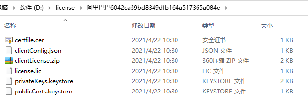
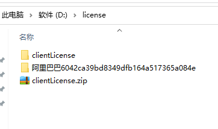

# true-license使用说明

1.服务端生成证书文件:
```
true-license-server模块，
客户机系统参数设置对象:
public class LicenseCreatorParamVO {

    /**有效期截至时间*/
    private Date expireTime;

    /**客户名称*/
    private String customerName;

    /**私钥库密码库，必须包含数字和字母*/
    private String storePass;

    /**私钥密码,必须包含数字和字母*/
    private String keyPass;

    /**描述信息*/
    private String description;

    /**额外的服务器硬件校验信息*/
    private LicenseExtraModel licenseExtraModel;
}
额外自定义参数对象:
public class LicenseExtraModel {

    /**客户机mac地址*/
    private String macAddress;

    /**客户机cpu核数*/
    private Integer cpuAmount;

    /**客户机gpu核数*/
    private Integer gpuAmount;

    /**
     * ram内存,单位：G
     * */
    private Integer ram;
}
运行测试类生成证书:
    @Test
    public void generateLicense() throws Exception {
        LicenseCreateService licenseCreateService=new LicenseCreateServiceImpl();
        //设置证书校验参数
        LicenseCreatorParamVO paramVO=new LicenseCreatorParamVO();
        paramVO.setCustomerName("阿里巴巴");   
        paramVO.setDescription("马云爸爸");
        paramVO.setKeyPass("123456a");
        paramVO.setStorePass("123456a");
        //设置过期时间
        Calendar calendar=Calendar.getInstance();
        long expire=new Date().getTime()+(24L*3600L*1000L);
        calendar.setTimeInMillis(expire);
        paramVO.setExpireTime(calendar.getTime());
        //设置额外校验参数
        LicenseExtraModel extraModel=new LicenseExtraModel();
        extraModel.setRam(16);
        extraModel.setCpuAmount(16);
        extraModel.setGpuAmount(16);
        extraModel.setMacAddress("2c:4d:54:65:d2:12");
        paramVO.setLicenseExtraModel(extraModel);
        licenseCreateService.generateLicense(paramVO);
    }
生成的证书将放置在windows: d:/license/customName+uuid, linux:  /data/license/customName+uuid
目录指定源代码:可自定义
//证书生成路径
    private String relativePath() {
        if (isWindows()) {
            return "d:/license/";
        }
        return "/data/license/";
    }
```
生成的证书的样子:

certfile.cer：没什么用
clientConfig.json： 包含了主题、公钥别名、公钥密码信息，提供给客户机进行认证
```
{"subject":"阿里巴巴","publicAlias":"阿里巴巴-public-alias","storePass":"123456a"}
```
license.lic: 证书
privateKeys.keystore： 私钥库
publicCerts.keystore： 公钥库
clientLicense.zip: 提供给客户机的压缩文件，包含证书、公钥库

2.客户机安装生成的证书进行参数校验
```
true-license-client模块
安装证书代码:启动类
    @Bean
    public LicenseInstallerBean licenseInstallerBean() throws Exception {
        //模拟获取客户机的校验参数信息,与证书生成时设置的参数需一致，否则无法安装证书
        ClientMachineParam clientMachineParam=new ClientMachineParam();
        clientMachineParam.setCpuAmount(16);
        clientMachineParam.setGpuAmount(16);
        clientMachineParam.setMacAddress("2c:4d:54:65:d2:12");
        clientMachineParam.setRam(16);
        LicenseInstallerBean licenseInstallerBean = new LicenseInstallerBean();
        //安装证书，即校验客户机器参数是否符合证书要求，符合则安装成功，不符合则报错无法启动。
        licenseInstallerBean.installLicense(clientMachineParam);
        return licenseInstallerBean;
    }
安装过程将会解压存放在windows: d:/license/clientLicense.zip, linux:  /data/license/clientLicense.zip的压缩包
源代码:可自定义
private String getLicensePath() {
    String os = System.getProperty("os.name");
    if (os.toLowerCase().contains("windows")) {
        return "d:/license/";
    }
    return "/data/license/";
    }
所以需要先把之前生成好的clientLicense.zip压缩包放在此目录上
```
解压后的样子:

系统参数校验:
主要校验clientConfig.json里面的主题、公钥别名、公钥密码信息，是否和生成的时候一致，也可以让客户机在代码层面上提供这些参数，本例是以配置文件的形式提供
还要校验证书生成时设置的过期时间
自定义额外参数的校验:这个根据需求自定义
````
/**
     * 重写验证证书方法，添加自定义参数验证
     * */
    @Override
    protected synchronized void validate(LicenseContent content) throws LicenseContentException {
        //系统验证基本参数：生效时间、失效时间、公钥别名、公钥密码
        super.validate(content);
        //验证自定义参数
        Object o=content.getExtra();
        if(o!=null && machineParam!=null && o instanceof LicenseExtraModel){
            LicenseExtraModel extraModel=(LicenseExtraModel) o;
            if(machineParam.getRam()!=extraModel.getRam()){
                throw new LicenseContentException("RAM内存不匹配");
            }
            if(machineParam.getCpuAmount()!=extraModel.getCpuAmount()){
                throw new LicenseContentException("CPU核数不匹配");
            }
            if(machineParam.getGpuAmount()!=extraModel.getGpuAmount()){
                throw new LicenseContentException("GPU核数不匹配");
            }
            if(!machineParam.getMacAddress().equals(extraModel.getMacAddress())){
                throw new LicenseContentException("MAC地址不匹配");
            }
        }else{
            throw new LicenseContentException("证书无效");
        }
    }
````
3.结果：提供给客户机的证书蕴含的所有参数与生成证书时的一致且在有效期内，将认证通过，否则不通过，应用无法启动。
4.总结:
1)服务端设置客户名称、有效期、公钥库密码、私钥密码，以及自定义的额外参数，生成一个证书和公钥、公钥别名
2)将生成的证书和公钥文件，客户名称、公钥别名、公钥库密码提给客户端
3)客户机应用启动时对这些证书和公钥文件以及客户名称、公钥别名、公钥库密码进行校验，获取客户机自定义的额外参数进行校验。

